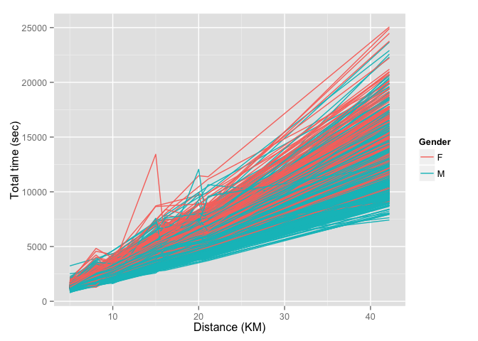

# Race Performance Prediction
John Stanton-Geddes  
May 19, 2015  

Avoiding the [Wall](https://www.youtube.com/watch?v=6pttqFUviWs) in a marathon requires careful pacing over the first half of the race. As most runners only race 1-2 marathons a year, it can be difficult to predict the correct target pace. The most widely-used [methods for predicting performance](http://run-down.com/statistics/calcs_explained.php) are all pretty [old](http://www.cs.uml.edu/~phoffman/xcinfo3.html). As a statistician, they also frustrate me for their lack of accounting for uncertainty. In this report, I use empirical observations of personal bests available from www.athlinks.com to derive a new and improved marathon performance predictor.

The ultimate goal is to answer the question *what should my goal for a marathon be based on a recent half-marathon performance?*  


# Data

I collected personal best times from a haphazard sample of athletes on (http://www.athlinks.com/) that had a marathon best time listed. To select the best data possible, I pulled results for the top 100 athletes from 15 regions, sorted by  `Race Count`, under the assumption that athletes with the most races would be more likley to have complete data (see details in `getPBdata.R` script). Further data cleaning yielded data a total of 1,333 athletes.

For these athletes, the plot of distance against race time shows a wider range at longer distances, as would be expected.

 

Grouping by gender and plotting on a log-scale, we see that men (blue) tend to be faster than women (red lines) at all distances.

 

However, grouping by gender ignores significant variation among athletes in performance. I calculated each athletes 'rank' in comparison to all other athletes in the dataset, and took their average rank across distances. As the dataset includes national caliber (e.g. 61 minute half-marathon) to much slower (e.g. 3 hour half-marathon) runners, this is representative of the entire US running population. 

In this figure, it appears that highly-ranked runners (Rank top 1-5%, darker lines) slow down less than recreational runners (Rank > 75%, lighter lines). 

 

# Method 1: predict change in pace with increasing distance

First, I tried to emulate methods that predict how much a runner's pace decreases in races of increasing distance. As the function of race time against distance appears to be nearly linear, I fit a linear model with a second-order polynomial to allow for slowing over longer distances, variables for gender and athlete rank, and allowed for interactions among all these.  

This figure shows the predicted values from the model (black lines) at Ranks of 10%, 50% and 90% for a male runner, against the raw data plotted in gray. This looks like a pretty good model!


```
## geom_smooth: method="auto" and size of largest group is <1000, so using loess. Use 'method = x' to change the smoothing method.
```

 


Intermediate to answering my ultimate question, I explored how much athletes of different ranks slowed down in races of increasing distances. From my observation above, I hypothesized that faster runners would slow less than slower runners. 

 

The above figure supports this hypothesis! Runners ranked in the top 10% only slow down by ~6% from the half to full marathon, whereas runners at the 90% rank slow by ~12%. 

# And my prediction is...


Taking this to a personal level, using my most recent half-marathon (1:12:22, 5th percentile) and the 5^th^ and 50^th^ percentiles as brackets, my predicted performance at a marathon is between 02:32:52 and 02:38:31.

While the fast end of my predictions is on par with the current [performance calculators](http://www.runningforfitness.org/calc/racepaces/rp/rpother?dist=13.1&units=miles&hr=1&min=12&sec=23&age=33&gender=M&Submit=Calculate), the slow end is quite a bit slower, indicating that these tools may be setting unrealistic expectations for most runners!

The problem with this approach is that my estimate range came from my own expectations of my performance. 

# Method 2: predict time directly

In the previous section, I used data on times across distances to predict how much a runner's pace slows down as the distance increases. An alternate approach is to directly predict a marathon time from a half-marathon or other race time. I explored this approach here.


```
## Analysis of Variance Table
## 
## Response: maratime
##                    Df     Sum Sq    Mean Sq   F value    Pr(>F)    
## hmaratime           1 6058798953 6058798953 3904.8780 < 2.2e-16 ***
## gender              1    2737145    2737145    1.7641    0.1843    
## athRank             1  550078593  550078593  354.5240 < 2.2e-16 ***
## hmaratime:gender    1   50896399   50896399   32.8026 1.266e-08 ***
## Residuals        1301 2018628353    1551598                        
## ---
## Signif. codes:  0 '***' 0.001 '**' 0.01 '*' 0.05 '.' 0.1 ' ' 1
```

```
## [1] "02:37:05"
```

Using this model, my marathon prediction is 02:35:51 to 02:38:19, which falls on the slow end of the range from the pace slow-down approach above. This also supports the conclusion that current marathon performance predictors produce overly optimistic predictions for runners.


# Notes and Such

This analysis done in [R](http://www.r-project.org/) using [RStudio](http://www.rstudio.com/) and these helpful packages. Special thanks to [rvest](http://blog.rstudio.org/2014/11/24/rvest-easy-web-scraping-with-r/) for making the web-scraping possible.


```
## R version 3.1.1 (2014-07-10)
## Platform: x86_64-apple-darwin13.1.0 (64-bit)
## 
## locale:
## [1] en_US.UTF-8/en_US.UTF-8/en_US.UTF-8/C/en_US.UTF-8/en_US.UTF-8
## 
## attached base packages:
## [1] stats     graphics  grDevices utils     datasets  methods   base     
## 
## other attached packages:
## [1] dplyr_0.4.1.9000 plyr_1.8.1       tidyr_0.2.0      mgcv_1.8-6      
## [5] nlme_3.1-120     lubridate_1.3.3  ggplot2_1.0.1    stringr_0.6.2   
## 
## loaded via a namespace (and not attached):
##  [1] assertthat_0.1       colorspace_1.2-6     DBI_0.3.1           
##  [4] digest_0.6.8         evaluate_0.6         formatR_1.1         
##  [7] grid_3.1.1           gtable_0.1.2         htmltools_0.2.6     
## [10] knitr_1.9            labeling_0.3         lattice_0.20-31     
## [13] lazyeval_0.1.10.9000 magrittr_1.5         MASS_7.3-40         
## [16] Matrix_1.2-0         memoise_0.2.1        munsell_0.4.2       
## [19] parallel_3.1.1       proto_0.3-10         Rcpp_0.11.5         
## [22] reshape2_1.4.1       rmarkdown_0.5.1      scales_0.2.4        
## [25] tools_3.1.1          yaml_2.1.13
```
